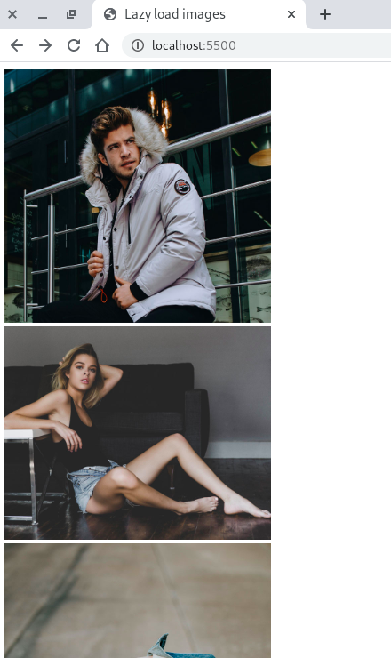

In the previous article we have learned about how to use `Intersection Observer` in modern browsers. In this article we will get to know the benefit of using this API. The main advantage of using this API could be the following.

- Lazy loading assets
- Infinite scrolling feed or posts
- Suppose You have very long page and you want to highlight the current section the user is reading as active in your navigation. It will also help in these things. For more details about how to implement this you can visit this beautiful article written by Robin Weiruch. He is a very good writer and i will urge you to follow him.
- It can also help in resuming or pausing animation when user scrolls through different sections.

Use cases of `Intersection Observer` API could be many. Above listed is only a few of them. In this article we will learn how to lazy load images in browser using this API. Let's get started.

### What does Lazy loading means? {#what-is-lazy-loading}

<hr/>

Lazy loading, as the name suggest loading assets lazily. Let's take an example. Suppose you are developing a news website. On homapage you have ten no. of posts, each post is taking half of viewport height. Each post have a image. So, If a user visits your website you want to load only first three posts including images, text, etc. But for all other posts you only want to load their texts. And as the user scrolls through the page you load images from top to bottom manner one by one. The advantage of using this approach would be following.

- Initial page loading time will increase due to less no. of network request.
- It will reduce data usage. Think of a user who comes to your website but doesn't scroll down. It would be a waste of data if we already have downloaded those images which he is never going to see. It's a type of mistake that a developer should always avoid. Because user's data is our utmost priority.

So far we have learnt the theoretical part. Let's build a small project on this. In this project we will have a bunch of images in html and we are going to lazy load it. That's it. Pretty simple right, Let's get started.

### Let's Begin {#lets-begin}

<hr>

I am just going to use a simple template for HTML which will have a bunch of `div` and `img` tags.

```HTML
<html lang="en">
  <head>
    <title>Lazy load images</title>
    <meta charset="utf-8" />
    <meta
      name="viewport"
      content="width=device-width, initial-scale=1, shrink-to-fit=no"
    />
    <link rel="stylesheet" href="css/style.css" />
  </head>
  <body>
    <div class="column">
      <div class="image">
        
      </div>

      <div class="image">
        
      </div>

      <div class="image">
        
      </div>

      <div class="image">
        
      </div>

      <div class="image">
        
      </div>

      <div class="image">
        
      </div>

      <div class="image">
        
      </div>

      <div class="image">
        
      </div>

      <div class="image">
        
      </div>

      <div class="image">
        
      </div>

      <div class="image">
        
      </div>

      <div class="image">
        
      </div>
    </div>
    <script src="js/manifest.js"></script>
  </body>
</html>
```

Note that I have not used `data-src` attribute on first three `img` tags. Because we should not lazy load the images above the fold. We do not want javascript to act as resistance in loading these images which are responsible for first contentful paint. Remember that Javascript blocks the main thread until the css is being downloaded. So, we have removed that attribute.

I have also used a placeholder image which will be downloaded once by the browser and used multiple times until the actual image download complete. Now it's time to style these images little bit.

```css
/* style.css */
.image img {
  min-width: 300px;
  width: 100%;
}
.column {
  display: flex;
  flex-wrap: wrap;
  flex-direction: column;
}
.image {
  text-align: center;
  max-width: 33.333333%;
}
```

Note that we are going in detail about styling. It is out of discussion for this article. You should reference other resources for this.
Let's take a look in browser.



Pretty Simple, Right. Now let's do the JS Part. Let's make a TODO list.
- Get the Image DOM Element except first three.
- Register an Observer on those Element
- In callback function, We have to change their src attribute.

Let's do the first part.
```js
const loadImages = [].slice.call(document.querySelectorAll(".image img"));
//  This array will include all the images. Bur we have to remove first three.
loadImages.slice(3); 
```
In the above snippet we have captured all the image nodes. Then I have removed the first three Nodes by using `Array.slice(start,end)` method. Now it will give me all the image nodes except first three.

```js
const options = { rootMargin: "0px 0px 50px 0px", threshold: 0.5 };
const Observer = new IntersectionObserver(callback,options);
loadImages.slice(3).forEach((image)=>{
    Observer.observe(image);
})
```
Now we have registered the Observer and assigned which element to observe. I have taken the `margin-bottom` 50px so that when Element have entered 50% inside from 50px below the viewport, I will get informed.

```js
function callback(entries,observer){
    entries.forEach((entry)=>{
        if(entry.isIntersecting){
            const DOMNode = entry.target;
            const src = DOMNode.dataset.src;
            DOMNode.src = src;
            observer.unobserve(DOMNode) 
        }
    })
}
```
Here, I am only concerned about entries which are intersecting. I am reading their `data-src` attribute and in next line I am setting it to current DOM Element's `src` attribute. Also, when it's set we want to remove the Element from observing list of observer. If I don't do that it would trigger every time I scroll through that section either up or down which is irrelevant and non-essential. To verify if it's working scrolls through the page and images will load automatically. You can also check network requests in chrome-dev tools as well.

### Summary {#summary}
<hr>
Let's summarize the JS snippet.

```js
window.addEventListener("DOMContentLoaded", () => {
  const loadImages = [].slice.call(document.querySelectorAll(".image img"));
  if ("IntersectionObserver" in window) {
    const observer = new IntersectionObserver(
      function (entries, observer) {
        entries.forEach((entry) => {
          if (entry.isIntersecting) {
            const DOMNode = entry.target;
            const src = DOMNode.dataset.src;
            DOMNode.src = src;
            observer.unobserve(DOMNode);
          }
        });
      },
      { rootMargin: "0px 0px 50px 0px", threshold: 0.5 }
    );
    loadImages.slice(3).forEach((e) => {
      observer.observe(e);
    });
  } else {
    // fallback to backward compatible code
  }
});
```